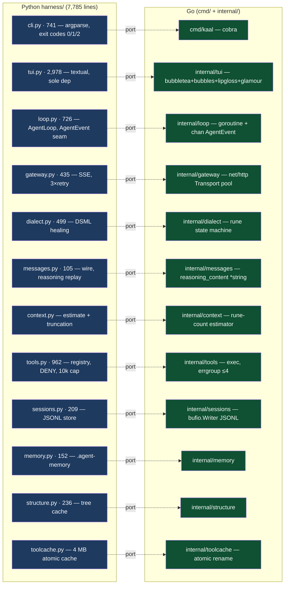
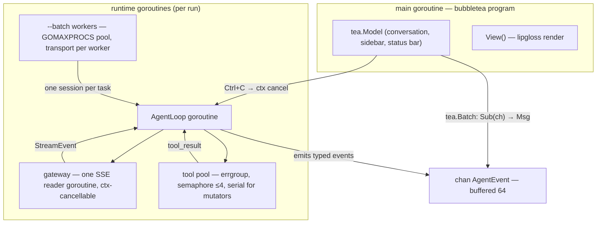

# kaal → Go — Migration Plan

> Status: **proposal** · Target: Go 1.24+ · TUI: bubbletea (charmbracelet) · Core: stdlib-first
> Companion diagram set: `docs/architecture.md` (current Python architecture)
>
> *The war of the seven formations — how kaal crosses from Python to Go, told in the
> manner of the great epic. Every number below is exact; the poetry is only the frame.*

## TL;DR

The war council has met, and the counsel is to cross the whole army. Port `kaal` —
7,785 lines of Python across 17 `harness/` modules, 13,877 with its tests — into a
single static Go binary. The Go host is raised in this same repo as `cmd/` +
`internal/` packages; the Python camp is left untouched until a **parity gate** is
won, and then the old camp is burned. The core (dialect, gateway, messages, loop,
context) marches stdlib-only; the bubbletea family (bubbletea, bubbles, lipgloss,
glamour) builds the new court's hall; `golang.org/x/sync/errgroup` is the sole foreign
standard in the core seam. The war lasts **20 person-days across 7 phases** — four
focused weeks, or six at half pace.

Why cross at all, in one breath: one static binary with no venv and no interpreter to
coax; goroutines and `net/http` connection pooling retire the per-thread socket
juggling and the four-worker thread pools; `context` sounds a retreat that truly
withdraws the army (today's TUI Ctrl+C only asks, it does not command); and bubbletea's
Elm-style `Cmd`/`Msg` model was built for exactly the `AgentEvent` stream that
`loop.py` already sends.

The two hard things of kaal — DSML healing and `reasoning_content` replay — are the
**first** arrows drawn, not the last, and are chained with table-driven tests ported
verbatim from `tests/test_dialect.py` (299 lines) and `tests/test_messages.py`.

## 1. Motivation — why the chariot must change horses

Krishna's counsel was never war for the joy of it, but because the road ahead asks more
of the chariot than the old wheels can give. The Python build serves well; yet five
bindings hold it back — and each has a Go answer:

| Pain in the Python build | Go answer |
|---|---|
| `textual` is the only dep, but TUI+loop share one GIL-threaded process; `call_from_thread` marshaling | bubbletea's `tea.Cmd`/`tea.Msg`/`tea.Sub` are designed for concurrent event sources; no widget-thread rules |
| Keep-alive needs per-thread sockets; `--batch` workers must not share a connection | `net/http.Transport` pools connections natively; one transport per worker goroutine is a dial option, not a workaround |
| Tool batches use ≤4 `ThreadPoolExecutor` workers under the GIL | `errgroup` + semaphore channel; true parallelism on CPU-bound scans (pure-Python grep fallback becomes ~10× faster via `bytes.Index`) |
| Cooperative Ctrl+C in the TUI (worker must notice) | `context.WithCancel` — Ctrl+C cancels the SSE request in flight; the stream unwinds for real |
| venv + uv bootstrap in installers; `kaal update` = git pull + reinstall | Single static binary; `kaal update` = fetch latest release artifact |
| Token estimate and truncation are Python-string heuristics | Same estimator ported 1:1; `utf8.RuneCountInString` is native and cheap |
| 13.9k lines, one interpreter to ship | ~11k lines of Go, zero runtime |

What we do not do: the Python tree is retired wholesale after the parity gate — there
is no long dual reign, no two kings on one throne. The omp auth-store sqlite read
(`~/.omp/agent/agent.db`) is carried over read-only with `modernc.org/sqlite` (pure Go,
no cgo); if it proves fragile it falls back to "env key / user key only" behind the
same resolution order.

## 2. Target layout — the order of the new camp

The camp is pitched with the same discipline the old one had: every tent in its place,
each with one purpose, and the kitchen (the TUI) the only tent allowed to borrow from
foreign merchants.

```
kaal/                     (module github.com/kaal/kaal — root of this repo)
├── cmd/kaal/             main.go — cobra root: run, sessions, doctor, update, diagrams
├── internal/
│   ├── gateway/          SSE client, wire body, 3× retry (1s/2s/4s), keep-alive
│   ├── dialect/          DSML state machine + leaked-token stripper (DialectFeed)
│   ├── messages/         wire structs; reasoning_content replay (*string)
│   ├── context/          token estimate, history truncation
│   ├── loop/             AgentLoop; chan AgentEvent; tool-loop detection; spawn_agent
│   ├── tools/            ToolRegistry, schemas, path confinement, DENY list, exec
│   ├── sessions/         JSONL store, resume replay
│   ├── memory/           .agent-memory digest, caps, dedupe
│   ├── structure/        .kaal/STRUCTURE.md cache (signature-keyed)
│   ├── toolcache/        .kaal/tool-cache.json (atomic, 4 MB cap)
│   ├── config/           constants, API-key resolution order
│   ├── prompts/          system prompt + AGENTS.md context (go:embed)
│   └── tui/              bubbletea app (the ONLY charmbracelet import)
├── harness/              ← frozen during migration; deleted at parity gate
└── tests/                ← frozen; ported to Go table tests, then deleted
```

**Dependency budget** — the vow of restraint, kept as the old core kept it:

- `internal/dialect|gateway|messages|context|loop` → stdlib only (`net/http`,
  `encoding/json`, `bufio`, `os/exec`, `path/filepath`, `sync`, `crypto/sha256`)
  **plus** `golang.org/x/sync/errgroup`.
- `internal/tui` → bubbletea, bubbles, lipgloss, glamour (markdown rendering; the
  Python `Markdown` widget's counterpart). Nothing else may import these.
- `cmd/kaal` → cobra (subcommand tree mirrors `kaal run/sessions/doctor/update/diagrams`).

## 3. Module-by-module mapping — the muster roll

Every warrior of the old army is named in the new roll; none is left behind, none is
renamed without reason. The dashed lines below are the crossing — each Python module
becomes one Go package with the same duty.



## 4. Concurrency model — the reins of the chariot

Arjuna drove with one hand on the reins and Krishna's eye on the field; so the Go
runtime keeps one hand on the loop and lets the framework carry the messages. The
Python seams become Go's natural idioms, and the **AgentEvent contract is preserved
byte-for-byte**, so the TUI and `kaal run` stay interchangeable consumers of the same
road.



The six decisions of the council:

1. **`chan AgentEvent` replaces `call_from_thread`.** The loop goroutine owns the whole
   turn; the TUI subscribes to the channel via bubbletea's standard
   `tea.Batch(tea.Tick, subscribe(ch))` pattern. No widget-thread rules to police — the
   framework was built for this.
2. **True cancellation.** `context.WithCancel` threaded through `Gateway.stream()`; Ctrl+C
   in the TUI sends `tea.Quit`/a cancel message → the in-flight SSE request dies, the
   loop records a partial turn, and the session JSONL stays consistent. Python's
   cooperative cancel becomes a hard guarantee.
3. **Connection pooling for free.** One `http.Transport` with `MaxConnsPerHost` per
   runtime; `--batch` gets a transport per worker goroutine — the Python per-thread
   socket workaround simply disappears. `KAAL_NO_KEEPALIVE` and proxy-env behavior stay
   honored (`DisableKeepAlives`, `ProxyFromEnvironment`).
4. **Tool batches.** Read-only batches (`read`/`grep`/`glob`) run under an `errgroup`
   with a semaphore capped at 4; any mutator in the batch flips a flag → serial execution
   in call order, exactly as today. Results and events are funneled back through the
   loop goroutine so ordering is deterministic.
5. **Persistence stays synchronous** in v1 (session append after each turn) — the JSONL
   is the source of truth and must not race the loop; async writes are a Phase 6
   optimization behind a flush-on-turn-end, only if profiling justifies it.
6. **`spawn_agent`** becomes a goroutine with an atomic depth counter (cap 2), sharing
   the tool pool but with `allow_dangerous=false` and no tool cache, as today.

## 5. TUI strategy — the new court, built by bubbletea

`tui.py` at 2,978 lines is the largest camp to move. The hall of the old court maps
room by room to the new one — nothing of the courtier's experience is lost:

| Textual today | bubbletea tomorrow |
|---|---|
| `Markdown` conversation pane (re-render throttled ~100 ms) | `bubbles/viewport` + glamour rendering; throttle via `tea.Tick` at the same cadence |
| Sidebar: Trace/Memory/Sessions | `bubbles/list` + `bubbles/viewport`; collapsible (sidebar hidden by default — preserve that) |
| Status bar + `/` slash commands | lipgloss `StatusBar` row; input mode with command parsing (`/help /new /resume /sessions /connect /memory /model /verbose /quit`) |
| Prompt history up/down | `bubbles/textarea` with custom history ring (small; keep in-repo) |
| `/models` modal with filter (recent addition) | `bubbles/list` in a modal layer — same filter semantics |
| Worker thread + `call_from_thread` | Loop goroutine + channel `Sub` (§4) |
| Ctrl+C cooperative cancel | context cancel (§4) |

Markdown rendering is the one real risk in this hall: glamour's tapestries differ from
Python's. The parity target is **semantic** (headings, code blocks, lists), not pixel;
visual differences are accepted and tuned in Phase 5.

## 6. The two hard things — the poisoned arrows

No warrior rides to Kurukshetra without knowing which arrows are poisoned; these two
are drawn first, and their antidotes are tests.

1. **DSML healing (`dialect`).** The `DialectFeed` state machine is ported 1:1 with the
   load-bearing unicode markers kept as rune constants (`FW = '\uff5c'`, `B = '\u2581'`).
   Go's UTF-8-native strings actually simplify this — no surrogate-pair arithmetic, and
   `bytes.Contains` on the raw UTF-8 works without decoding. All 299 lines of
   `tests/test_dialect.py` become table-driven Go tests **before** the implementation
   ships, including: leaked chat-template token stripping, `flush()` discard semantics
   (≥1 invoke → discard; 0 invokes → recover as text), and the "envelope after visible
   text is a quote" rule.
2. **`reasoning_content` replay (`messages`).** Krishna's counsel from the previous
   day's battle must ride into the next day's — drop it and the gatekeeper answers with
   a 400. Go's zero-value pitfall is real: an empty string is indistinguishable from an
   absent field. The wire struct uses `ReasoningContent *string` — replay happens iff
   the pointer is set — and a golden test asserts the turn-2 request body is
   byte-identical to the Python fixture (this is the exact 400-on-turn-2 trap, caught at
   unit level).
3. **Wire constraints** are enforced by `TestBuildBody`: never send `tool_choice`,
   `temperature`, `stream_options`, `store` — ported as struct-field absence assertions.

## 7. Phases — seven formations, and the eighteenth day

The war is fought in seven named formations — Chakra the wheel, Makara the crocodile,
Garuda the eagle, Kurma the tortoise, Suchi the needle, Padma the lotus, Krauncha the
heron — and closes on the eighteenth day, when the parity gate is won and the old camp
burns. Each formation has its day count; the sum is 20 person-days.

```mermaid
flowchart LR
    P0["P0 · skeleton<br/>toolchain, layout, CI<br/>1 day"] --> P1["P1 · wire layer<br/>dialect + messages + gateway<br/>3 days"]
    P1 --> P2["P2 · loop + tools<br/>AgentLoop, registry, guards<br/>4 days"]
    P2 --> P3["P3 · persistence<br/>sessions, memory, structure,<br/>toolcache · 2 days"]
    P3 --> P4["P4 · CLI<br/>cobra: run, sessions, doctor,<br/>update, diagrams · 2 days"]
    P4 --> P5["P5 · TUI<br/>bubbletea surface, parity<br/>tuning · 4 days"]
    P5 --> P6["P6 · concurrency wave<br/>pool tuning, async persist<br/>2 days"]
    P6 --> P7["P7 · parity gate<br/>corpus diff, python tree<br/>removal · 2 days"]
```



- **P0 — Chakra vyuha, the wheel (1 d).** The axle on which all else turns: `go.mod`
  (Go 1.24), `cmd/kaal` stub with `--version` printing `kaal 0.3`, CI matrix
  (linux/macos/windows static builds), `install.sh`/`install.ps1` rewritten to fetch a
  release artifact, `kaal update` = release fetch. Python tree untouched; both camps
  stand side by side.
- **P1 — Makara vyuha, the crocodile (3 d).** The jaws that seize the wire: the two
  hard things (§6) + `gateway` with `httptest` fixtures ported from
  `tests/test_gateway.py` (511 lines): retry backoff 1s/2s/4s, no retry after visible
  content, 4xx immediate raise, `StreamEvent` typing.
- **P2 — Garuda vyuha, the eagle (4 d).** The swift talons: `AgentLoop` goroutine +
  `chan AgentEvent`; tool registry with path confinement (`filepath.Rel` + prefix
  check), DENY list, 10k-char cap, bash timeout (30 s default / 300 s max,
  `exec.CommandContext`), rg-backed grep with pure-Go fallback, `read` offset 1-based.
  Port `tests/test_loop.py::test_two_turn_tool_call_flow` first — it is the whole loop
  contract in one test. Tool-loop detection, 5-failure abort, exit-code mapping (0/1/2).
- **P3 — Kurma vyuha, the tortoise (2 d).** The steady back that bears the world:
  JSONL sessions (`%Y%m%d-%H%M%S` ids, `KAAL_SESSIONS_DIR` override), resume replay,
  `.agent-memory` (200-line cap, 4k-token digest, verbatim dedupe), `structure` tree
  cache (depth ≤6, ≤20k entries, ≤500 lines, sig comment, first 120 lines into the
  prompt), `toolcache` (sha256|sig key, 4 MB cap, atomic temp+rename, mutator-batch
  bypass).
- **P4 — Suchi vyuha, the needle (2 d).** The single point of command: cobra mirror of
  every flag and exit code in `kaal run --help`; stdin `-` prompt; `--json` final line;
  `--batch` with worker pool; verify hooks (`.kaal/hooks.json`, 30 s timeout,
  `[verify]` user message); `--no-tool-cache`, `--no-verify`, `--allow-dangerous`,
  `--resume`, `--dir` cwd confinement.
- **P5 — Padma vyuha, the lotus (4 d).** The beauty that blooms over the water:
  bubbletea surface per §5; slash commands; session switcher; markdown parity tuning;
  `--verbose` reasoning pane. The `AgentEvent` channel makes this a consumer swap — the
  loop is not touched.
- **P6 — Krauncha vyuha, the heron (2 d).** The quick darting strike, profiling-driven:
  transport tuning (`MaxConnsPerHost`, idle timeouts), async session persistence behind
  flush-on-turn-end, pure-Go grep parallelization across files, batch worker autoscaling.
- **P7 — the eighteenth day, the parity gate (2 d).** The final confrontation: run
  Python and Go binaries on the same corpus (20+ prompts drawn from `tests/` fixtures)
  and diff: final answers, session JSONL shape, tool-call sequences, reasoning replay on
  turn 2+. Gate = dialect/messages tables 100% green, wire bodies byte-identical on turn
  2+, no corpus regressions. Then the old camp burns: `harness/`, `tests/`, and the
  textual dependency are deleted — kaal is Go.

## 8. Risks — Shakuni's dice, counted

The dice of the migration are loaded, as all dice are; the counsel's craft is to count
them before they fall. Each risk has its mitigation chained to it:

| Risk | Mitigation |
|---|---|
| Dialect behavior drift breaks healing | Port `test_dialect.py` tables first; they are the ground truth, not the implementation |
| Zero-value `reasoning_content` silently dropped → 400 on turn 2+ | `*string` field + golden request-body test (§6) |
| glamour vs Python markdown visual drift | Semantic parity target; visual tuning budget in P5 |
| Token-estimator drift changes truncation behavior | Port estimator 1:1; golden fixtures from `test_context.py` |
| exec-based bash tool diverges (env, cwd, quoting) | Port `test_tools.py` cases (556 lines) as-is; same DENY list verbatim |
| omp sqlite read breaks (cgo/corrupt db) | `modernc.org/sqlite` pure-Go, read-only, wrapped in the existing fallback order |
| Dual-tree repo confusion during migration | `harness/` frozen by CI rule (no Python edits after P0); removed at gate |
| bubbletea learning curve on the 2,978-line TUI | The channel seam keeps loop/TUI decoupled; TUI rewritten feature-by-feature, not wholesale |

## 9. Open questions for the dice hall

1. **Go version floor** — propose 1.24 (slices/iterators, `os.Root` confinement). Confirm toolchain policy (mise? go directive only?).
2. **cobra or stdlib `flag`** for the CLI — cobra mirrors the subcommand tree and `--help` output; stdlib keeps deps at zero. Leaning cobra (CLI ergonomics are user-facing).
3. **Release distribution** — GitHub Releases tarballs (simplest, matches current install.sh UX) vs `go install` vs both.
4. **Windows parity** — bubbletea supports Windows (conpty); keep `install.ps1` equivalent in P0 or drop Windows at the gate?
5. **`kaal diagrams` (termaid)** — keep as a Go port of the renderer, or shell out to an installed termaid? Leaning: shell out, it's a dev tool, not the agent surface.
6. **Repo strategy** — same repo (proposed) vs separate `kaal-go` repo. Same repo keeps the parity gate honest.

## 10. Deliverables checklist

- [ ] `cmd/kaal` builds one static binary; `--version` = `kaal 0.3`
- [ ] dialect + messages table tests 100% green (ported from Python)
- [ ] turn-2 request body byte-identical (reasoning replay golden test)
- [ ] `kaal run` full flag/exit-code parity (0/1/2)
- [ ] sessions/memory/structure/toolcache round-trip tests green
- [ ] bubbletea TUI: split pane, slash commands, Ctrl+C hard cancel
- [ ] parity corpus: no regressions vs Python
- [ ] `harness/` + `tests/` deleted; README/AGENTS.md updated to Go reality
