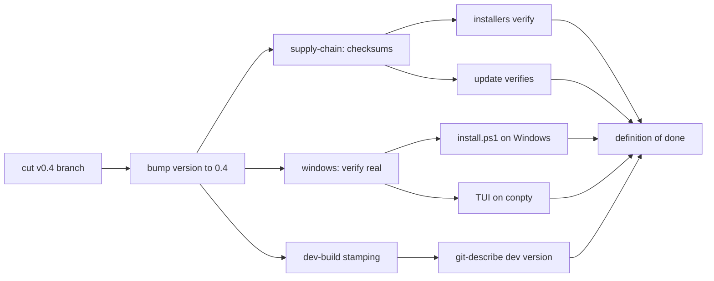

# Roadmap — v0.4: The Trusted Crossing

v0.3 crossed the river: the Go port stands, `kaal update` can fetch a prebuilt
binary, six platform binaries ship in GitHub Releases, and installers exist for
both camps. What remains before v0.4 is a worthy release is **trust** — that the
binary you install is the binary we built — and **completion** — that Windows is
a first-class citizen, not a promise.

Each pillar below is checkboxed with its acceptance criteria. A pillar is done
only when every box is checked by a real run, not by inspection.

## The field, in one map

## Pillar 1 — Supply-chain hardening

The releases carry no checksums; `install.sh`, `install.ps1`, and
`kaal update`'s release-fetch verify only that the bytes answer `--version`.
A MITM or a compromised asset would install without complaint.

- [ ] Release workflow generates a `checksums.txt` (SHA-256 of every asset)
      and attaches it to the release.
- [ ] `install.sh` downloads `checksums.txt` and verifies the binary against
      it before the `--version` probe.
- [ ] `install.ps1` does the same via `irm`/`Get-FileHash`.
- [ ] `updateFromRelease` (`internal/cli`) verifies the fetched asset against
      `checksums.txt` before the probe and swap.
- [ ] A tamper test exists: a corrupted asset (wrong hash) is rejected by all
      three paths with a clear message.

*Acceptance:* `checksums.txt` present on v0.4; a flipped byte in the download
fails the install/update with "checksum mismatch".

## Pillar 2 — Windows completion

Windows got the `bash` tool parity and an installer, but neither has been
executed on a real Windows box: `install.ps1` was reviewed and its endpoints
probed, not run; the bubbletea TUI has never been exercised under conpty.

- [ ] `install.ps1` run on a Windows runner (CI job or a local VM): install,
      PATH entry, `kaal --version`, `kaal run` smoke test.
- [ ] TUI smoke test on Windows: launch, `/models`, a run with Ctrl+C cancel.
- [ ] `go-build` workflow verified green on all three OSes after the v0.4
      version bump (its version probe is hardcoded — see Pillar 3).
- [ ] Fix whatever the above surfaces (conpty quirks, path separators,
      `cmd.exe` quoting) and lock it with tests where possible.

*Acceptance:* a Windows user can install with `irm … | iex`, run the TUI, run
`kaal run`, and `kaal update` — all without a Git Bash workaround.

## Pillar 3 — Dev-build versioning

`version` in `internal/cli` defaults to the last release, so a binary built
from the v0.4 branch still answers `kaal 0.3` — indistinguishable from the
shipped release, and `kaal update` will not know it is behind. The CI probe in
`.github/workflows/go.yml` hardcodes `kaal 0.3` and will break on the bump.

- [ ] `version` becomes build-time-derived: `git describe` stamp
      (`0.4-dev-<sha>` off the v0.4 tag) when built from a checkout; the
      release workflow keeps the exact tag stamp.
- [ ] `compareVersions` treats `-dev` suffixes sanely (a dev build never
      "updates" itself into the same tag).
- [ ] The go.yml probe derives the expected version from the source instead of
      hardcoding it.

*Acceptance:* a checkout build reports `0.4-dev-…`; the tag build reports
`0.4`; `kaal update` on a dev build fetches the release.

## Pillar 4 — Release automation polish

The v0.3 workflow is minimal and worked. A few low-cost guards make the next
cut boring:

- [ ] Auto-changelog derives from conventional commits (the release notes are
      already auto-generated; tighten the grouping).
- [ ] `kaal update --dry-run` reports the would-be target version without
      downloading the whole asset (reuse the release-metadata call).
- [ ] Decide the release cadence/process: tag on merge to `main`, branch
      policy for `docs/go-migration-plan` (merge it first — the install
      one-liners and roadmap live there).

*Acceptance:* cutting v0.4 is: bump version → tag `v0.4` → CI ships.

## Optional candidates (pick by demand)

Not committed; each is a self-contained slice that could ride along or wait
for v0.5:

- [ ] **Session export/import** (`kaal sessions export <id>`, import on
      `--resume` from a file) for portability and backups.
- [ ] **Model catalog auto-refresh** — `/models` reads a cached JSON; fetch a
      fresh catalog on a schedule or a `/models refresh` command.
- [ ] **Cost transparency in the TUI** — per-turn token/cost line in the
      transcript (the data is already in `Usage`).
- [ ] **`read_url` / web tool** — the harness is repo-bound by design; a
      fetch-with-confinement tool would need explicit policy work, so it stays
      optional and gated.

## Definition of done — cutting v0.4

- [ ] `version = "0.4"` stamped by the release workflow, dev builds distinct.
- [ ] `checksums.txt` shipped and verified by install + update.
- [ ] Windows: install.ps1, TUI, `kaal run`, `kaal update` all exercised on a
      real Windows runner.
- [ ] `go-build` green on ubuntu/macos/windows at the tag.
- [ ] Install one-liners (curl/irm) work from `main` — requires merging
      `docs/go-migration-plan` first.
- [ ] Changelog written from conventional commits; release notes sane.
